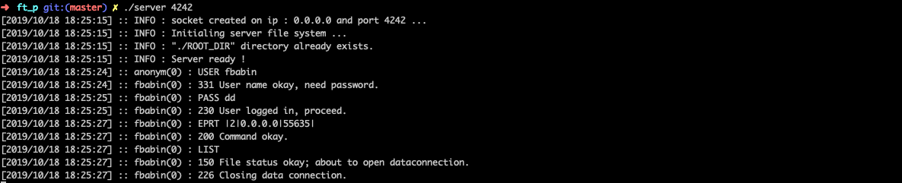
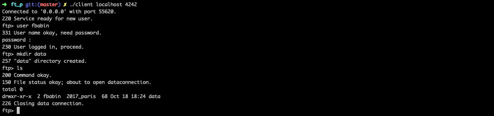

# ft_p

This project is an introduction to socket programming. We have to create a `ftp server` program and a `ftp client`.


## Server

The server accept connections from several clients and interpret them in order to store and retrieve files owned by users. The server support [RFC](https://tools.ietf.org/html/rfc959) and IPV6. The server can be run with the following command :

```
./server <port>
```

nb : if the port given is not available another one 

The following commands can be interpreted by the server :

| Command | Description |
| ---     | --- |
| USER \<username> | authenticate user |
| PASS \<password> | authenticate user with given password |
| SYST | send system information to the client |
| QUIT | send aquit signal to the client |
| CDUP | change directory to root |
| CWD  \<path> | change working directory |
| PWD | show current directory |
| MKD \<path> | create a new directory |
| RMD \<path> | remove the directory |
| LIST \<path> | list the file of the given directory |
| DELE \<path> | delete the file |
| PORT \<ip>\,\<port> | connect to the given ip and port (ipv4) |
| EPRT \|\<ip_version>\|\<ip>\|\<port>\| | connect to the given ip and port |
| RETR \<path> | send the file to the client |
| STOR \<path> | store the file on the server |
| NOOP | send an OK message |

<p>

<p/>

## Client

The ftp client connects to the ftp server and send command to put or retrieve files from the server. The client support [RFC](https://tools.ietf.org/html/rfc959) and IPV6. The client can be run with the command :

```
./client <ip> <port>
```

The following commands are available with the client :

| Command | Description |
| ---     | --- |
| user \<username> | authenticate user on server |
| lcd \<path> | local change of working directory |
| lpwd | local current directory |
| lls \<path> | local list of given directory |
| cd \<path> | change working directory |
| ls \<path> | list given path |
| pwd | get current location (on server) |
| mkdir \<path> | create directory |
| rmdir \<path> | remove directory |
| get \<path> | get file from the server |
| put \<path> | put file to the server |
| rm \<path> | remove file from the server |
| quit | quit current user |


<p >

<p/>